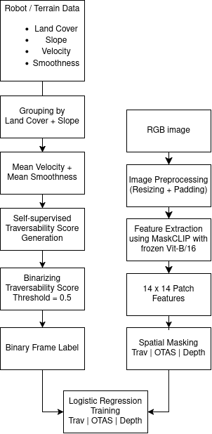
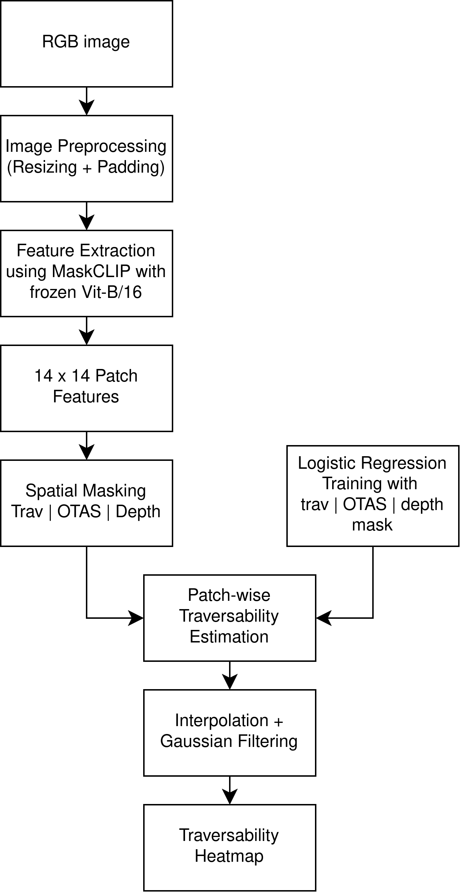

<div align="center">

# Self-Supervised Traversability Estimation using Vision-Language Model Features


### Master Thesis – Robotics Engineering

A framework for self-supervised visual traversability estimation using pretrained MaskCLIP features and robot telemetry.

</div>

---

## About

This repository contains the implementation developed for the master thesis **"Self-Supervised Traversability Estimation using Vision-Language Model Features"**.

The approach investigates whether visual representations learned by a pretrained Vision-Language Model (VLM) can be used for traversability estimation (TE) without task-specific fine-tuning of the visual backbone.

Robot telemetry is used to generate self-supervised traversability labels. RGB images are represented using patch-level features extracted from **MaskCLIP with a CLIP ViT-B/16 backbone**. A logistic regression classifier maps the resulting visual embeddings to traversability probabilities.

Three strategies for selecting spatially relevant image patches are evaluated:

- **Traversability mask (`trav`)** – fixed image region representing the area in front of the robot
- **OTAS mask (`otas`)** – semantic ground/path selection using OTAS (https://github.com/SimonSchwaiger/otas.git)
- **Depth mask (`depth`)** – geometric selection of patches within 5 m of the robot

The models are trained on data recorded with the **Mattro ROVO3** and evaluated both in-domain and across different robots and datasets.

---

## Method Overview

The general pipeline is:
Offline Training:
<div align="center">

</div>

Online Testing:
<div align="center">

</div>

The MaskCLIP visual encoder remains **frozen**. Only the logistic regression classifier is trained.

---

## Datasets

The implementation supports three datasets / platforms:

| Dataset | Role | Usage |
|---|---|---|
| **Mattro Rovo3** | Training + in-domain testing | Model training and reference evaluation |
| **Boston Dynamics Spot** | Cross-platform testing | Evaluation without retraining |
| **RELLIS-3D** | Cross-dataset testing | Evaluation without retraining |

The trained Mattro models are directly applied to SPOT from RoboNav and WARTHOG from RELLIS-3D to evaluate transfer without robot- or environment-specific retraining.

Dataset files are not included in this repository and need to be downloaded in their respective folders. In this repository there are the links for downloading in the folders in the READMEs.

For ROVO3:
```
01_mattro_imu_220623_072923.csv in datasets/robonav/mattro_route1/csv_files
mattro_kantine.csv in datasets/robonav/mattro_route1/csv_files
mattro_01_2022-06-23-07-29-23.bag in datasets/robonav/mattro_route1
```

For SPOT:
```
spot_kantine.csv in datasets/robonav/spot_route1a/csv_files
spot_01_2022-06-22-10-12-24.bag in datasets/robonav/spot_route1a
```

For RELLIS-3D:
```
00000_00.bag in datasets/rellis_3d/00000_00
```


---

## Traversability Ground Truth

Traversability supervision is generated automatically from robot telemetry.

The score combines robot velocity and motion smoothness. A future temporal offset is used to associate terrain visible in an image with the physical interaction experienced by the robot shortly afterwards.

The default parameters are:

| Parameter | Value |
|---|---:|
| Future window | 2.0 s |
| Traversability threshold | 0.5 |
| Depth threshold | 5.0 m |
| Input resolution | 224 x 224 |
| MaskCLIP backbone | ViT-B/16 |
| Patch grid | 14 x 14 |
| Feature dimension | 512 |

A continuous telemetry-derived traversability score is converted into a binary training label using the threshold of `0.5`.

---

## Spatial Patch Selection

### Traversability Mask

The `trav` configuration uses a fixed spatial region in the image to approximate the terrain directly in front of the robot.

```text
Mask = fixed rectangular 
```

### OTAS Mask

The `otas` configuration uses semantic segmentation from OTAS to retain ground/path regions.

```text
Mask = padding mask + OTAS mask
```

No additional fixed traversability ROI is applied.

### Depth Mask

The `depth` configuration uses stereo depth to retain patches within 5 m of the robot.

```text
Mask = padding mask + depth <= 5 m
```

No additional fixed traversability ROI is applied.

---

## Project Structure

```text
.
├── project_config.py
├── train.py
├── test.py
│
├── preprocessing/
│   ├── extraction_rosbag_robonav.py
│   ├── extraction_spot_rosbag_robonav.py
│   ├── extraction_rosbag_rellis.py
│   ├── rectify_images.py
│   ├── prepare_images_robonav.py
│   ├── prepare_images_robonav_SPOT.py
│   ├── prepare_images_rellis.py
│   ├── robonav_save_depth.py
│   ├── rellis_save_depth.py
│   ├── robonav_extractOTAS.py
│   ├── rellis_extractOTASMask.py
│   ├── image_utils.py
│   ├── depth_utils.py
│   ├── otas_utils.py
│   └── rosbag_utils.py
│
└── utils/
    ├── features.py
    ├── masks.py
    ├── depth.py
    ├── traversability.py
    ├── models.py
    ├── evaluation.py
    └── visualization.py
```

`project_config.py` contains shared paths and experimental parameters. Dataset-specific processing is kept separate where required, while common functionality is implemented in reusable utility modules.

---

## Requirements

The project is implemented in Python and primarily uses:

- Python
- PyTorch
- MaskCLIP / CLIP
- scikit-learn
- NumPy
- pandas
- OpenCV
- Pillow
- Matplotlib
- rosbags
- OTAS

### External Repositories

MaskCLIP ONNX:

https://github.com/RogerQi/maskclip_onnx

OTAS:

https://github.com/SimonSchwaiger/otas

The exact environment depends on the MaskCLIP, CUDA and OTAS installations. Separate environments for MaskCLIP and OTAS due to their dependency requirements.

---
# Installation
Download this repository:
```
git clone 
```

Create a conda environment for MaskCLIP:
```

```

Create a conda environment for OTAS:
```

```


# Running the Pipeline

All commands are executed from the project root.

In the MaskCLIP conda environment:

## 1. Mattro Preprocessing

Extract the RoboNav data:

```bash
python preprocessing/extraction_rosbag_robonav.py
```

Rectify the stereo images:

```bash
python preprocessing/rectify_images.py --dataset mattro
```

Create the randomized train/test image split and prepare the 224 x 224 inputs:

```bash
python preprocessing/prepare_images_robonav.py
```

Generate stereo depth:

```bash
python preprocessing/robonav_save_depth.py \
    --dataset mattro \
    --no-visualizations
```

In the OTAS conda environment:

Generate OTAS masks for the training and test subsets:

```bash
python preprocessing/robonav_extractOTAS.py \
    --dataset mattro \
    --split train

python preprocessing/robonav_extractOTAS.py \
    --dataset mattro \
    --split test
```

---

## 2. Training

All models are trained using Mattro data.

In the MaskCLIP conda environment:

### Fixed Traversability Mask

```bash
python train.py --mask trav
```

### OTAS Mask

```bash
python train.py --mask otas
```

### Depth Mask

```bash
python train.py --mask depth
```

The MaskCLIP backbone remains frozen. A `StandardScaler` and logistic regression classifier are fitted to the selected patch embeddings.

---

## 3. Mattro Evaluation

Evaluate the three models on Mattro:

```bash
python test.py --dataset mattro --mask trav
python test.py --dataset mattro --mask otas
python test.py --dataset mattro --mask depth
```

To calculate the metrics without generating individual heatmaps:

```bash
python test.py --dataset mattro --mask trav --no-heatmaps
python test.py --dataset mattro --mask otas --no-heatmaps
python test.py --dataset mattro --mask depth --no-heatmaps
```

---

## 4. SPOT Preprocessing

Extract the SPOT data in the MaskCLIP environment:

```bash
python preprocessing/extraction_spot_rosbag_robonav.py
```

Rectify and prepare the images:

```bash
python preprocessing/rectify_images.py --dataset spot

python preprocessing/prepare_images_robonav_SPOT.py
```

Generate depth:

```bash
python preprocessing/robonav_save_depth.py \
    --dataset spot \
    --no-visualizations
```

Generate OTAS masks in the OTAS environment:

```bash
python preprocessing/robonav_extractOTAS.py \
    --dataset spot \
    --split test
```

---

## 5. SPOT Cross-Platform Evaluation

No additional training is performed on SPOT.

In the MaskCLIP environment:

```bash
python test.py --dataset spot --mask trav
python test.py --dataset spot --mask otas
python test.py --dataset spot --mask depth
```

---

## 6. RELLIS-3D Preprocessing

Extract and prepare the RELLIS-3D data in the MaskCLIP environment:

```bash
python preprocessing/extraction_rosbag_rellis.py

python preprocessing/prepare_images_rellis.py
```

Generate stereo depth:

```bash
python preprocessing/rellis_save_depth.py
```

Generate OTAS masks in the OTAS environment:

```bash
python preprocessing/rellis_extractOTASMask.py
```

---

## 7. RELLIS-3D Cross-Dataset Evaluation

No additional training is performed on RELLIS-3D.

In the MaskCLIP environment:

```bash
python test.py --dataset rellis --mask trav
python test.py --dataset rellis --mask otas
python test.py --dataset rellis --mask depth
```

---

## Evaluation

The implementation reports binary traversability performance using:

- F1 score
- Matthews Correlation Coefficient (MCC)
- Confusion matrix

During training, additional metrics including accuracy, precision, recall and ROC-AUC are reported.

The classifier outputs a continuous traversability probability in the range `[0, 1]`. A threshold of `0.5` is used for binary evaluation.

---

## Output

```text
trained logistic regression models
StandardScaler parameters
patch-level traversability probabilities
traversability heatmaps
confusion matrices
evaluation metrics
```

Heatmap generation can be disabled during evaluation using:

```bash
--no-heatmaps
```

This is useful when only numerical evaluation is required.

---

## Reproducibility

Important experimental parameters are defined centrally in `project_config.py`.

The default configuration uses:

```text
MaskCLIP backbone:       ViT-B/16
Image resolution:        224 x 224
Patch grid:              14 x 14
Patch feature dimension: 512
Future window:           2.0 s
Traversability threshold: 0.5
Depth threshold:         5.0 m
```

---

## Results

The experiments investigate three main settings:

1. **In-domain evaluation:** Mattro -> Mattro
2. **Cross-platform evaluation:** Mattro -> SPOT
3. **Cross-dataset and cross-platform evaluation:** Mattro -> WARTHOG on RELLIS-3D

Detailed quantitative and qualitative results are presented in the corresponding master thesis.

---

## Limitations

The telemetry-derived supervision describes the physical interaction of the robot with terrain along its driven trajectory. Assigning this signal to selected visual patches therefore represents supervision rather than dense pixel-wise ground truth.

Furthermore, the visual backbone is kept frozen. The experiments consequently evaluate the information available in the pretrained representation rather than the performance achievable through task-specific VLM fine-tuning.

Dataset-specific sensor availability also requires differences in telemetry preprocessing, particularly for RELLIS-3D.

---

## Acknowledgements

This project builds upon the following open-source projects and research:

- [CLIP](https://github.com/openai/CLIP) – pretrained vision-language representation
- [MaskCLIP ONNX](https://github.com/RogerQi/maskclip_onnx) – dense CLIP feature extraction
- [OTAS](https://github.com/SimonSchwaiger/otas) – semantic terrain masking
- [RoboNav](https://github.com/ethz-asl/robonav) – robotic navigation dataset
- [RELLIS-3D](https://github.com/unmannedlab/RELLIS-3D) – multimodal off-road dataset

Please refer to the original repositories and publications for their respective licenses and citation requirements.

---

## Citation

If you use this repository in academic work, please cite the corresponding master thesis:

```bibtex
@mastersthesis{bolt2026traversability,
  author = {Leonie Bolt},
  title  = {Self-Supervised Traversability Estimation using Vision-Language Model Features},
  school = {FH Technikum Wien},
  year   = {2026},
  type   = {Master's thesis}
}

## License

This repository contains code developed as part of a master thesis and integrates or depends on external open-source projects.

Please check the licenses of CLIP, MaskCLIP, OTAS, RoboNav and RELLIS-3D before redistribution or reuse.
